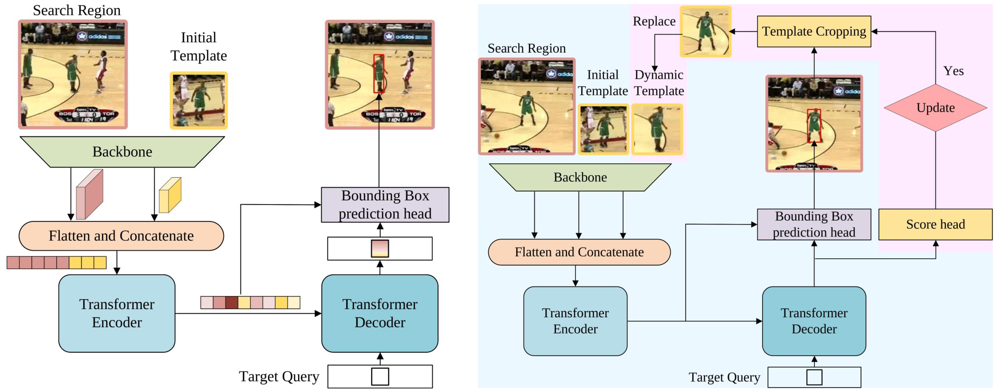

# STARK
The official implementation of the paper **Learning Spatio-Temporal Transformer for Visual Tracking**

## Highlights

### End-to-End, Post-processing Free

STARK is an **end-to-end** tracking approach, which directly predicts one accurate bounding box as the tracking result, without using any hyperparameters-sensitive post-processing.

### Purely PyTorch-based Code

STARK is implemented purely based on the PyTorch. 

## Install the environment
**Option1**: Use the Anaconda
```
conda create -n stark python=3.6
conda activate stark
bash install.sh
```
**Option2**: Use the docker file

We provide the complete docker at [here](https://hub.docker.com/repository/docker/alphabin/stark)

## Data Preparation
Put the tracking datasets in ./data. It should look like:
   ```
   ${STARK_ROOT}
    -- data
        -- lasot
            |-- airplane
            |-- basketball
            |-- bear
            ...
        -- got10k
            |-- test
            |-- train
            |-- val
        -- coco
            |-- annotations
            |-- images
        -- trackingnet
            |-- TRAIN_0
            |-- TRAIN_1
            ...
            |-- TRAIN_11
            |-- TEST
   ```
Run the following command to set paths for this project
```
python tracking/create_default_local_file.py --workspace_dir . --data_dir ./data --save_dir .
```
After running this command, you can also modify paths by editing these two files
```
lib/train/admin/local.py  # paths about training
lib/test/evaluation/local.py  # paths about testing
```

## Train STARK
Training with multiple GPUs using DDP
```
# STARK-S50
python tracking/train.py --script stark_s --config baseline --save_dir . --mode multiple --nproc_per_node 8  # STARK-S50
# STARK-ST50
python tracking/train.py --script stark_st1 --config baseline --save_dir . --mode multiple --nproc_per_node 8  # STARK-ST50 Stage1
python tracking/train.py --script stark_st2 --config baseline --save_dir . --mode multiple --nproc_per_node 8 --script_prv stark_st1 --config_prv baseline  # STARK-ST50 Stage2
# STARK-ST101
python tracking/train.py --script stark_st1 --config baseline_R101 --save_dir . --mode multiple --nproc_per_node 8  # STARK-ST101 Stage1
python tracking/train.py --script stark_st2 --config baseline_R101 --save_dir . --mode multiple --nproc_per_node 8 --script_prv stark_st1 --config_prv baseline_R101  # STARK-ST101 Stage2
```
(Optionally) Debugging training with a single GPU
```
python tracking/train.py --script stark_s --config baseline --save_dir . --mode single
```
## Test and evaluate STARK on benchmarks

- LaSOT
```
python tracking/test.py stark_st baseline --dataset lasot --threads 32
python tracking/analysis_results.py # need to modify tracker configs and names
```
- GOT10K-test
```
python tracking/test.py stark_s baseline_got10k_only --dataset got10k_test --threads 32
python lib/test/utils/transform_got10k.py --tracker_name stark_s --cfg_name baseline_got10k_only
```
- TrackingNet
```
python tracking/test.py stark_s baseline --dataset trackingnet --threads 32
python lib/test/utils/transform_trackingnet.py --tracker_name stark_s --cfg_name baseline
```
- VOT2020  
Before evaluating "STARK+AR" on VOT2020, please install some extra packages following [external/AR/README.md](external/AR/README.md)
```
cd external/vot20/<workspace_dir>
export PYTHONPATH=<path to the stark project>:$PYTHONPATH
# export PYTHONPATH=/data/sda/v-yanbi/iccv21/STARK:$PYTHONPATH 
bash exp.sh
```
- VOT2020-LT
```
cd external/vot20_lt/<workspace_dir>
export PYTHONPATH=<path to the stark project>:$PYTHONPATH
# export PYTHONPATH=/data/sda/v-yanbi/iccv21/STARK:$PYTHONPATH 
bash exp.sh
```
## Test FLOPs, Params, and Speed
```
# Profiling STARK-S50 model
python tracking/profile_model.py --script stark_s --config baseline
# Profiling STARK-ST50 model
python tracking/profile_model.py --script stark_st2 --config baseline
# Profiling STARK-ST101 model
python tracking/profile_model.py --script stark_st2 --config baseline_R101
```

## Model Zoo
The trained models, the training logs, and the raw tracking results are provided in the [model zoo](MODEL_ZOO.md)

## Acknowledgments
* Thanks for the great [PyTracking](https://github.com/visionml/pytracking) Library, which helps us to quickly implement our ideas.
* We use the implementation of the DETR from the official repo [https://github.com/facebookresearch/detr](https://github.com/facebookresearch/detr).  
